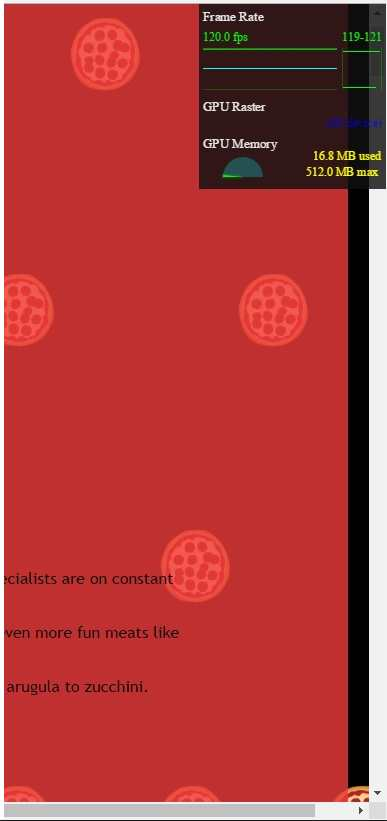
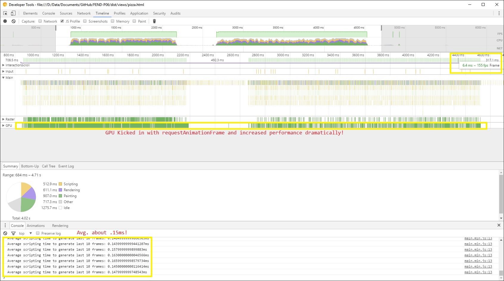

## FEND-P06 Website Performance Optimization Portfolio
#Running the Website
Setup is simple for testing the site, you don't need a web server:
1. Download the zip or fork the repo.
2. Extract or copy the "Dist" folder, or its contents to another folder.
3. Run index-critical.html in your browser.

For development of improvements:
1. Do the same as above but you need all of the files and folders, minus the contents of "Dist" which will be generated on build, in their current structure from this repository.
2. Use the project.json and gulpfile.js to retrieve the necessary modules and versions used.
3. Modify source and build is a two step process.
	1. "gulp makeBuild"
	2. Between gulp builds, empty the contents of "/src/tmp-img/" (I know...but a lot of coolgulp plugins aren't being updated enough.)
	3.  "gulp critical"
Now you can run index-critical from the "Dist" folder.

###Objective:
The goal of this assignment is to analyze a poorly performing website, identify the issues that are preventing it from functioning as expected, and optimizing it iteratively, until it meets or surpasss the required level of performance.

The final website submitted must pass two key tests in order to be considered optimized.  It must be able to get a [Google PageSpeed](https://developers.google.com/speed/pagespeed/) score of 90 or higher.  It must also maintain a minimum sustained rate of 60 frames per second during any user activity on the page "pizza.html".

### Initial Website Design and Code Review:
Initial review of the code and analysis of potential issues required running the website and navigating from page to page.  This allowed me visually experience and identify the least performing areas which would cause a bad user experience. I noted these areas in order to focus on the code that correspondedto said areas during the code review.

To have an understanding of the current condition and also to have a benchmark for comparison afterwards, I used PageSpeed on a version of the website running on my server, using the original, untouched source code and documented the results.

- [Initial PageSpeed Desktop results](../doc/results_initial/PageSpeed%20Insights_Mobile.pdf)
- [Initial PageSpeed Mobile results](../doc/results_initial/PageSpeed%20Insights_desktop.pdf)

According to the score, the performance was substandard, and since I loaded the website on several physical systems, all of which  had the same exact issue in the same exact places, it could not be attributed to hardware.  This was a software issue and would require further analysis. If the same person that designed the "Pizza" page also coded the rest of the  website, I would probably suggest scrapping this code and giving him a copy of "Wordpress for Dummies".

#Optimization for PageSpeed
###The Setup
The initial landing page rated ***28/100*** on PageSpeed.  Analysis of the source code proved several key issues.
1. The HTML was incomplete, missing key metadata and the code for HTML and CSS were apparently maintained over time, or perhaps by different individuals because there was a lack of organization and no adherence to guidelines or for current HTML5 standards.
2. There were several JavaScript files linked in the HEAD of several pages, which caused delay in page rendering while the browser processed each one completely.
3. The website did not use any consistent framework throughout.  There was only one page using "Bootstrap" and then only the "Grids".  This increases the challenge because each page can be coded in an entirely different way.
4. None of the code or assets where minified, compressed or otherwise processed to improve performance.

In order to assess the exact issues throughly, I needed an objective pair of "eyes". I copied the code to my development environment and setup a workflow for my friend, "Gulp".  As part of any development process, Grunt or Gulp can provide key information for debugging purposes. Although this is not a development exercise from inception, it can be of great benefit to use an automation tool with linters and testers, in this case, to be used to pinpoint issues in problematic code within minutes whereas it could take one person several hours, days or longer to do the same.  It also prepares your environment for the switch from troubleshooting to coding and eventually producing the fixed version of the code slong with documentation of your workflow. Gulp ran the workflow as I had designed and once again reminded me that I am human, so several revisions later, I had an acceptable workflow for building the new code from the old code and assets.

###Optimization
After running the workflow to Lint the HTML, CSS and JavaScript, I saw the screen spew forth the expected barrage of issues. HTML elements not closed, CSS was a bit messy and redundant, JS was not too bad...maybe the guys was a developer who was tasked with designing a web page for the first time? I should tell him to try Udacity!  I manually fixed the issues that were found in the error log I had compiled but I concentrated solely on "index.html" because it would serve as a model or baseline for what I would probably find in the other pages.  You can review the Gulp output for the linting process here: [Error.log](../doc/gulp_lint_log/debug.log)

To allow PageSpeed access to the webpage, I tried the combination of SimpleHTTPServer and NGROK, but from experience I knew that this would not be sufficient...I could get a bit more help with the optimization process if I setup a VM with NGINX and exposed that through my firewall in a DMZ.  One of the features NGINX has is the ability to compress files on the fly, according to rules that I provide, so that the code and assets are delivered quicker than without.  I took a couple of hours to configure and secure, and monitor, and secure, and iterated this for a while until the web server logs were normal (there are a lot of bored people out there apparently).

After reviewing the code through Chrome Developer Tools, I found that the Javacript files were definitely blocking the DOM, so I moved them down many lines in the code, right before "</body>". The Google Font was also called incorrectly, as it downloaded every language set and version for the chosen font, which I corrected and immediately saw improvement.  I also corrected the HTML to make sure each IMG element had width and hieght and also resized the images in my Gulp workflow to get a version that was small enough in size but still able to produce good quality when resized, since the page was meant to be responsive. That made a huge difference, especially in the case of "Pizzeria.jpg" which weighed in at a hefty 2.25MB (stop the insanity!)

I created a Gulp configuration with the usual minimizers, compressors and various other workflow steps [gulpfile.js](../gulpfile.js).  This required several hours and iterations as I had to adjust the workflow whenever I found new things to address in the code, and I could probably spend as much time improving this the gulp workflow as I could actually doing the assignment (Don't miss the forest for the workflow!) The untouched, original code was kept in the folder named "SRC" and the new version was written out to "DIST".  Once I had the Gulp workflow solid and saw the initial results were favorable, I deployed the build to NGINX and ran PageSpeed.  This time the score was ***30/100***, a 5% increase based on compression alone. Not enough but a I'll stick with it even if it takes a thousand cuts.

Frustration began to form as I reviewed the code and could not make sense of the CSS mishmosh.  I reorganized the CSS and ran it again.  Slight improvement, but what was I missing.  I followed all of the rules and kept everything seperate, HTML, CSS and JS.  Then I remembered that small JS or CSS can be inlined to increase performance if not used by other pages.  The JS routine for Google Analytics was definitely reused, so I made a separate file for it and set both JS file includes to "async". I then decided to check for any updated versions of the Google Analytics JS file.  Absolutely, not only was there a newer version, but there was a specific version (an IIFE which loads it into the Global space, I believe) that was designed to prevent blocking!  Even better, while I was drawn towards other topics on Google's Optimization site, I found a project named "Critical", also available as a Gulp module, which ran after the build process and programatically creates an "index-critical.html" which contains parts of the JS and CSS files that would normally block and automatically inlines them!  I couldn't type the updates to my gulpfile fast enough!  When I finally had a build ready with the new "critical" version of the "index.html" file, I tested with PageSpeed again and achieved a score of **99/100**! The Gods have smiled on me for once.  Funny enough, the 1% I was deducted was due to the low caching time associated with the Google Analytics JS file, but I'm happy with 99% and I doubt either Sergey or Larry would take my call about this issue anyway.

Most of the other pages had the same issues as "index.html" and my OCD forced me to fix them, even though it didn't matter for the purpose of this assignment, it mattered to me. So an hour or so was spent on those updates.

#Optimizing "Pizza.html"
###The Setup
My first reaction was to scrap it and build a new design, but that isn't allowed in the rules (well, not explicitly prohibited but it would circumvent the crux of the assignment.)  There was considerable work to be done so I decided to start with the web page itself, since it had the same issues I had seen with the previous pages.

###Optimization
While inspecting the JS file through Chrome Dev Tools, I found a function, named "updatePositions()", which seems to take a relatively inordinate amount of time to finish.  The function updates the position of little moving pizzas images in the background (totally unnecessary for this site but I've seen worse on Geocities). combing through the code for that function and then realizing that the same issue may be found in other parts of the JS file, I started from the top, identified and fixed the following issues.

1. Specified the size of IMG files set with JS.
2. Replaced the instances of QuerySelector with instances of GetElementByID or GetElementByClass, where applicable, especially within loops.
3. Spawned the minimum number of "movers"(pizzas) to fill the browser window, instead of the arbitrary 200 intances.
4. Simplified the code inside of loops as much as possible, moving whichever lines of code outside of the loop and ensuring the remaining lines have the least posssible impact on the CRP.
5. Tried using the "Transform" style method, although I reversed the commit because it could drain mobile battery power while running.
5. The most significant change came from using "requestAnimationFrame()", which I researched thoroughly for the video game assignment and now I see it has uses outside of the video game and Canvas environment.  The "Time to Draw 10 frames" dropped from 10-13ms to 0.01-0.03ms instantly with this one change!  My graphics card was now in play and offloaded this part of the work for the browser (as nature, or NVidia, intended.)
6. Because I have a smidgen of OCD, I had to take the 3 methods that handle "resizePizza" and refactor them into one that is more concise and required a fraction of the element lookups used in the original methods.

All of this, coupled with the optimizations provided by "Critical" (thanks you Addy Osmani, another fantastic tool contributed to the community) and the NGINX web server's speed and on the fly compression, I was able to get a ==***99% score on PageSpeed and "Time to 10 Frames" was brought down to a fraction of a millisecond with minimal change to the existing codebase and no need to refactor!***==

**The proof is...** 
[.](../doc/results_final/Time_to_resizePizzas.jpg)
**...is in the pudding** 

#Further Optimizations?
There is always potential for improvement.  For "Pizza.html", I could have continued along with the following:
1. Pre-populating the Pizza list by separating that function into its own file and loading it into the Global space  during an earlier page render, **asyncronously**.  This would allow the data to sit in memory until Pizza.html loads and then pulls in the pizza combinations.
2. The same as above but leveraging a **web worker**. (I wanted to implement that in this project but with constant improvement I would never be able to submit the project, so maybe in the next iteration.)
3. Redesigned the site **using proven frameworks and patterns**.  There is no need to rebuild the wheel when so many other versions are already available.  Instead, focus on the integration that becomes a synergy of these parts, unless you believe that your wheel is superior in comparison, then...what the heck...you gotta do what you gotta do!

If you've read this far, thank you for your kind indulgence.  If you didn't, then you probably missed the part about "requestAnimationFrame()".  I reward my audience!

**Valar Morghulis!**
Rlugojr

##References
(These articles made the project clearer to understand and much easier to solve.  Thankfully, because I only had the weekend in which to complete the bulk of the setup, config and development!)

[Critical Rendering Path course](https://www.udacity.com/course/ud884).
[Chrome Dev Tools tips-and-tricks](https://developer.chrome.com/devtools/docs/tips-and-tricks).
[PageSpeed rules and recommendations](https://developers.google.com/web/fundamentals/performance/critical-rendering-path/page-speed-rules-and-recommendations?hl=en)
[addyosmani/Critical](https://github.com/addyosmani/critical)
[MDN - Translate()](https://developer.mozilla.org/en-US/docs/Web/CSS/transform-function/translate)

*I will update this list if I recall any articles I may have omitted accidentally.*
### Optimization Tips and Tricks
* [Optimizing Performance](https://developers.google.com/web/fundamentals/performance/ "web performance")
* [Analyzing the Critical Rendering Path](https://developers.google.com/web/fundamentals/performance/critical-rendering-path/analyzing-crp.html "analyzing crp")
* [Optimizing the Critical Rendering Path](https://developers.google.com/web/fundamentals/performance/critical-rendering-path/optimizing-critical-rendering-path.html "optimize the crp!")
* [Avoiding Rendering Blocking CSS](https://developers.google.com/web/fundamentals/performance/critical-rendering-path/render-blocking-css.html "render blocking css")
* [Optimizing JavaScript](https://developers.google.com/web/fundamentals/performance/critical-rendering-path/adding-interactivity-with-javascript.html "javascript")
* [Measuring with Navigation Timing](https://developers.google.com/web/fundamentals/performance/critical-rendering-path/measure-crp.html "nav timing api"). We didn't cover the Navigation Timing API in the first two lessons but it's an incredibly useful tool for automated page profiling. I highly recommend reading.
* <a href="https://developers.google.com/web/fundamentals/performance/optimizing-content-efficiency/eliminate-downloads.html">The fewer the downloads, the better</a>
* <a href="https://developers.google.com/web/fundamentals/performance/optimizing-content-efficiency/optimize-encoding-and-transfer.html">Reduce the size of text</a>
* <a href="https://developers.google.com/web/fundamentals/performance/optimizing-content-efficiency/image-optimization.html">Optimize images</a>
* <a href="https://developers.google.com/web/fundamentals/performance/optimizing-content-efficiency/http-caching.html">HTTP caching</a>

####Prepared and submitted by Ray Lugo, Jr.